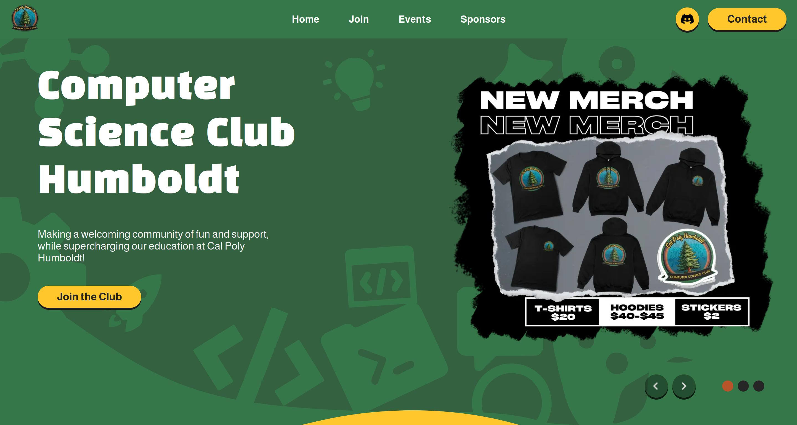

This is the new CS Club Humboldt website built with [Next.js](https://nextjs.org).



## Getting Started

First, run the development server:

```bash
npm run dev
# or
yarn dev
# or
pnpm dev
# or
bun dev
```

Open [http://localhost:3000](http://localhost:3000) with your browser to see the result.

Folders, and their purposes:
- `app` uses next.js's router system, which is where most all pages go
- `components` is where all the components get placed. Components are elements of the website which are going to be reused across 1 or more pages.
- `public` is where all static images and other static files get put, for pages to then reference. Note that public gets placed in the root when built.
- `events` contains all the markdown (.md) files which get turned into csclubhumboldt.org/events/[id] pages when the website is built.
- `hooks`, `lib`, and `pages/api` are all souly there for the API for searching and retriving events/event cards 


This project uses [`next/font`](https://nextjs.org/docs/app/building-your-application/optimizing/fonts) to automatically optimize and load [Almarai](https://fonts.google.com/selection?query=Almarai) for all text that isn't a header, and a more styled [Black Han Sans](https://fonts.google.com/selection?query=Black+Han+Sans) for special headers.

## Learn More about Next.js

To learn more about Next.js, take a look at the following resources:

- [Next.js Documentation](https://nextjs.org/docs) - learn about Next.js features and API.
- [Learn Next.js](https://nextjs.org/learn) - an interactive Next.js tutorial.

## Deployed on Netlify

We used automatic deployment from Netlify to automatically pull and deploy any pushes to main. Importantly, run `npm run build` locally to see any errors and suggestions by next before pushing to main, just to reduce racking up deploy time on netlify. They only allow so much...


